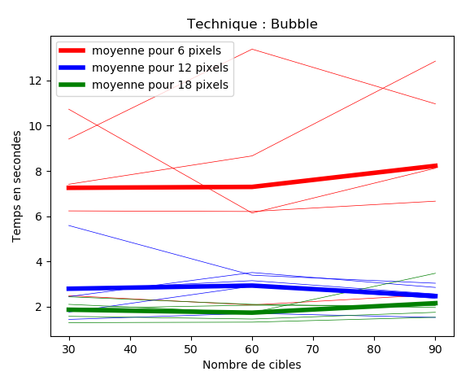

# Expérience IIHM

# Larzul Hippolyte

## Expérience contrôlée

### Objectif :

L’objectif de l’expérience est de tester différentes méthodes de pointage de souris, sur des cibles de différentes tailles, afin de mesurer la vitesse d’exécution.

### Mise en place :

L’expérience à été programmée en python avec notamment la bibliothèque PyQt5.

La première méthode de pointage est de créer une ‘bulle’ entre la souris et la cible la plus proche, qui s’agrandit ou se rétrécit en fonction de la distance.

L’image suivante montre le fonctionnement du pointage par ‘bulle’.


La seconde méthode de pointage consiste à créer une ligne entre la souris et la cible la plus proche, qui s’agrandit ou se rétrécit en fonction de la distance.

L’image suivante montre le fonctionnement du pointage par ‘corde’.


Enfin, la troisième technique est un pointage simple.

### Réalisation de l’expérience :

Pour réaliser l’expérience, un nombre donné de cibles sont générées aléatoirement sur une grille en fonction de leur taille, et d’un espacement minimum.

A chaque fois, une cible change de couleur, c’est la cible à sélectionner.

Pour cette expérience nous avons pris 3 tailles de cibles ( 6, 12, 18 pixels ), et 3 densité différentes ( 30, 60, 90 cibles). Pour tester les trois techniques différentes, nous auront donc 27 grilles à tester par participant. 

Chaque participant doit sélectionner 10 cibles sur chaque grille, donc nous auront 270 données à utiliser par participant.

### Hypothèses :

Nous voulons vérifier si la technique impacte la sélection des cibles.

Pour cela nous testons avec différentes densités et tailles variées.

On peut émettre l’hypothèse que le pointage classique est le plus efficace, car le plus habituel.

Le pointage par ‘corde’ n’altère pas beaucoup le pointage, et peut même guider l’utilisateur.

Le pointage par ‘bulle’ peut être gênant pour l’utilisateur si la bulle prend de la place et se modifie en bougeant.

### Résultats :

Les données des résultats sont écrites par un programme dans des fichiers en fonction du numéro d’utilisateur rentré.

Après avoir fait passer plusieurs candidats sur les différentes techniques, on obtient les graphiques suivants en fonction de la technique :

### Bubble :



### Rope :


### Normal :


### Analyse des résultats :

Ces graphiques nous montrent les différentes données des utilisateurs, et les moyennes de temps en fonction du nombre de cibles et de leurs tailles.

Pour la technique de ‘bulle’, on voit bien que plus la cible est petite, plus il est difficile de la sélectionner, et si elle est plus grande c’est environ équivalent.

Pour la technique de ‘corde’, on voit aussi que les cibles de taille 6 pixels posent plus de problèmes que les grandes. Mais le temps est largement inférieur à la technique de ‘bulle’.

Pour la technique normale, les résultats sont à peu près équivalents.

Comme les courbes des différents graphiques ont une tendance horizontale, on peut déduire que le nombre de cibles ne modifie pas, ou peu le temps de sélection. Le fait qu’il y ait plus de cibles aux alentours ne perturbe pas l’utilisateur.

### Conclusion :

Pour résumer, on peut affirmer que le nombre important ou non de cibles ne joue pas sur le temps de sélection.

Par contre la taille de la cible influe beaucoup sur la sélection, car plus la cible est petite, plus il est difficile de la repérer et de cliquer dessus.

La technique influe aussi sur le temps de sélection, la technique de bulle prend plus de temps que celle de corde, qui prend plus de temps que la technique normale.

On peut se demander si c’est à cause de l’habitude de pointer sans être guidé, ou si c’est parce que les techniques où l’on rajoute un phénomène de visualisation perturbe l’utilisateur.

Le code de l’expérience est disponible à l’adresse ci-dessous :

[https://gitlab.univ-lille.fr/hippolyte.larzul.etu/bubble-cursor](https://gitlab.univ-lille.fr/hippolyte.larzul.etu/bubble-cursor)

Pour effectuer l’expérience, il faut se placer dans le dossier “python”, puis lancer la commande :

```bash
$ python3 MainBubble.py
```

Larzul Hippolyte
# Bubble-cursor
